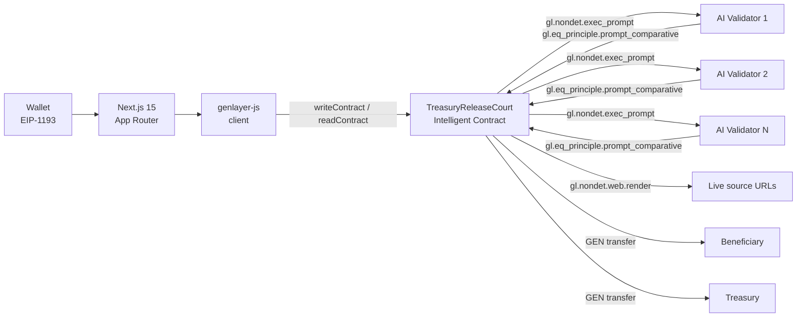

# Treasury Release Court

**A DAO tranche sits in an Intelligent Contract until an AI jury decides work is DONE
against a written charter.** Humans and agents on a committee file work. A minority
can post a bond and force a second jury to re-read the *same frozen documents* before
any GEN moves.

## Problem / solution in 5 lines

1. DAO treasury releases are usually either a rubber-stamp multisig or a slow
   token vote — neither actually reads the work against the mission.
2. Treasury Release Court locks a tranche in a GenLayer Intelligent Contract behind
   a written **charter**.
3. Committee members (human or agent) file **work packets** with live URLs as evidence.
4. Once frozen, an **AI jury** reaches equivalence consensus on DONE vs NOT_DONE —
   real judgment over natural language and live web content, not a vote.
5. Any committee member can **appeal** by bonding GEN, forcing a second jury to
   re-read the exact same frozen evidence before funds are ever released.

## Architecture



## Contract method table

| Method | Type | Who | Notes |
|---|---|---|---|
| `add_committee_member(member, kind)` | write | steward | SETUP only, `kind` = `human`/`agent` |
| `fund()` | write, payable | anyone | exact `tranche_wei`, SETUP → FUNDED |
| `cancel()` | write | steward or treasury | pre-jury only, refunds treasury |
| `submit_work(title, body, source_url)` | write | committee | FUNDED only |
| `freeze_submissions()` | write | steward or committee | needs ≥1 packet, locks `evidence_digest`, FUNDED → FROZEN |
| `score_work()` | write | anyone | first AI jury, FROZEN → ADJUDICATED |
| `appeal()` | write, payable | committee | exact `appeal_bond_wei`, within appeal window, ADJUDICATED → APPEAL_PENDING |
| `reread()` | write | anyone | second AI jury over the *same* digest, APPEAL_PENDING → ADJUDICATED |
| `settle()` | write | anyone | after appeal window elapses with no bond held, moves GEN |
| `receive_surplus()` | write, payable | anyone | accepts surplus GEN sent outside the `fund()` flow |
| `get_court()` | view | anyone | full court state as a dict |
| `get_charter()` | view | anyone | immutable charter text |
| `get_packets()` | view | anyone | all filed work packets |
| `get_verdicts()` | view | anyone | full verdict history across rounds |

State machine: `SETUP → FUNDED → FROZEN → ADJUDICATED → (APPEAL_PENDING → ADJUDICATED)* → SETTLED`,
with `CANCELLED` reachable from `SETUP`/`FUNDED`/`FROZEN` only.

## Repo layout

```
treasury-release-court/
  contracts/TreasuryReleaseCourt.py   # the Intelligent Contract (source of truth)
  tests/direct/                       # gltest state-machine guard tests (LLM/web mocked)
  tests/integration/                  # notes for live Studio testing
  deploy/deploy.ts                    # real fee-estimated deploy script
  frontend/                           # Next.js 15 App Router dashboard
  gltest.config.yaml
  README.md
```

## Deploy instructions

### Studio UI (fastest for a demo)

1. Open [GenLayer Studio](https://studio.genlayer.com), create/import an account, and
   use the faucet to fund it with test GEN.
2. Upload `contracts/TreasuryReleaseCourt.py`.
3. Deploy with constructor args (all numeric args are passed **as strings**):
   - `charter`: e.g. `"The committee must ship a public dashboard reachable at a live URL."`
   - `beneficiary`: address to receive GEN on a DONE verdict
   - `treasury`: address to receive GEN on NOT_DONE, surplus, forfeited bonds, and cancellations
   - `tranche_wei`: e.g. `"10000000000000000000"` (10 GEN)
   - `appeal_bond_wei`: e.g. `"2000000000000000000"` (2 GEN)
   - `submission_window_sec`: e.g. `"300"`
   - `appeal_window_sec`: e.g. `"180"`
   - `committee_csv`: e.g. `"0xHuman,0xAgent"`
   - `committee_kinds_csv`: e.g. `"human,agent"`
4. Copy the resulting contract address into `frontend/.env.local`.

### CLI

```bash
cp deploy/.env.example deploy/.env
# fill in DEPLOYER_PRIVATE_KEY, BENEFICIARY_ADDRESS, TREASURY_ADDRESS,
# COMMITTEE_CSV, COMMITTEE_KINDS_CSV
npm install
npm run deploy
```

The script (`deploy/deploy.ts`) calls `client.estimateTransactionFeesForDeploy`,
submits with those exact fees, and waits for `ACCEPTED` then `FINALIZED` before
printing the deployed address — no fee estimation is skipped, matching the
frontend's write path.

> **SDK note for judges:** `deploy/deploy.ts` is written against the
> `genlayer-js` v0.8 API surface described in the GenLayer docs
> (`createClient`, `estimateTransactionFeesForDeploy`, `waitForTransactionReceipt`).
> Account creation from a raw private key is exposed differently across
> `genlayer-js` minor versions (`createAccount` vs `privateKeyToAccount`) —
> if `npm run deploy` errors on that import, check
> `node_modules/genlayer-js/dist/*.d.ts` for the exact export name in the
> version that gets installed and adjust the one import line accordingly. The
> Studio UI path above has no such dependency and is the safest fallback for
> a live demo.

### Frontend

```bash
cd frontend
cp .env.example .env.local
# set NEXT_PUBLIC_CONTRACT_ADDRESS and NEXT_PUBLIC_CHAIN
npm install
npm run dev
```

Open http://localhost:3000, connect an EIP-1193 wallet pointed at the same
network (studionet / studio-dev), and the dashboard starts polling `get_court`.

## Demo walkthrough (matches the required end-to-end script)

1. Deploy with the sample charter above, a 2-member committee (1 human + 1 agent
   account), a 10 GEN tranche, a 2 GEN bond, 300s submission / 180s appeal windows.
2. **Steward tools → Fund**: send the exact tranche from a faucet-funded wallet.
3. **Work packets**: the human account submits a packet with a real public
   `https://` URL as evidence.
4. Switch wallet to the agent account, submit a second packet.
5. **Work packets → Freeze submissions**: locks the evidence digest.
6. **Jury actions → Run first jury**: watch fee estimation → submitted →
   accepted → finalized, then the verdict card renders DONE/NOT_DONE, score,
   and reason.
7. **Jury actions → Post appeal bond** from the minority committee member
   (exact bond, payable, confirm sheet shown first).
8. **Jury actions → Run second jury**: reread reuses the same evidence digest;
   the bond returns to the appellant if the verdict flips, or is forfeited to
   treasury if it holds.
9. Wait for the appeal window countdown to close, then **Settle**: GEN moves
   to the beneficiary (DONE) or treasury (NOT_DONE).
10. Dashboard shows `SETTLED` and updated balances; polling stops.

## Testing

```bash
npm install -g gltest   # or per GenLayer docs
gltest tests/direct
```

`tests/direct/test_state_machine.py` covers:
- cannot `score_work` before `freeze_submissions`
- cannot `settle` while the appeal window is still open
- wrong bond amount reverts on `appeal`
- non-committee accounts cannot `submit_work`
- `cancel` is blocked once a jury has ruled
- the evidence digest is stable across the first jury call

Only these direct-mode tests mock `gl.nondet.exec_prompt` / `gl.nondet.web.render`
/ `gl.eq_principle.prompt_comparative` (via the gltest harness) so guards run
deterministically. **Nothing in `tests/integration/` or the frontend mocks
these** — every jury call from the UI is a real on-chain consensus round-trip.
`tests/integration/` holds notes for exercising the same flow live against
Studio once a contract is deployed.

## Environment variables

| Var | Where | Purpose |
|---|---|---|
| `NEXT_PUBLIC_CONTRACT_ADDRESS` | `frontend/.env.local` | deployed contract address |
| `NEXT_PUBLIC_CHAIN` | `frontend/.env.local` | `studionet` or `studio-dev` |
| `DEPLOYER_PRIVATE_KEY` | `deploy/.env` | steward account used to deploy |
| `BENEFICIARY_ADDRESS`, `TREASURY_ADDRESS` | `deploy/.env` | payout recipients |
| `TRANCHE_GEN`, `APPEAL_BOND_GEN` | `deploy/.env` | decimal GEN amounts |
| `SUBMISSION_WINDOW_SEC`, `APPEAL_WINDOW_SEC` | `deploy/.env` | demo-friendly short windows |
| `COMMITTEE_CSV`, `COMMITTEE_KINDS_CSV` | `deploy/.env` | comma-separated addresses / kinds |

## Studio vs Bradbury

- **Studio (studionet / studio-dev)** simulates account balances via the
  built-in faucet — GEN there is test currency with no real value, ideal for
  the demo script above. Fee estimation still runs for real against the
  Studio network's fee model.
- **Bradbury** (or any public GenLayer network) charges real fees and moves
  real GEN. The same `writeWithFees` / `deploy.ts` code path works unchanged —
  only `NEXT_PUBLIC_CHAIN` / `CHAIN` and the funding source change. Add a
  Bradbury chain entry to `resolveChain()` in `frontend/src/lib/genlayer.ts`
  and `deploy/deploy.ts` (matching whatever `genlayer-js/chains` exports for
  it) before pointing either at a public network.

## Engineering notes

- Every write in the UI (`fund`, `submit_work`, `freeze_submissions`,
  `score_work`, `appeal`, `reread`, `settle`, `add_committee_member`, `cancel`)
  goes through `writeWithFees()` in `frontend/src/lib/genlayer.ts`: real
  `estimateTransactionFeesForWrite` → `writeContract` → wait for `ACCEPTED` →
  wait for `FINALIZED`, with every stage surfaced in the UI and contract
  `UserError` text cleaned up and shown, never swallowed.
- Reads (`get_court`, `get_packets`, `get_verdicts`, `get_charter`) poll via
  TanStack Query against `stateStatus: "accepted"` and stop polling once the
  court reaches `SETTLED` or `CANCELLED`.
- All chain-returned dicts are normalized into typed frontend shapes in
  `lib/genlayer.ts` (`normalizeCourt`, `normalizePackets`, `normalizeVerdicts`)
  — no raw `any` leaks into components.
- The contract tracks its own GEN holdings in a `gen_balance` field, updated
  on every inflow (`fund`, `receive_surplus`) and outflow (`cancel`,
  `settle`, bond payouts in `reread`), rather than querying a runtime
  balance API — `gl.message` only exposes per-call info (sender, value of
  *that* call), not the contract's running balance. `get_court()` exposes
  `gen_balance` for the frontend to display.
- The jury prompt explicitly marks work packets and fetched URL content as
  **untrusted evidence**, separate from the binding charter, to reduce prompt
  injection risk from submitted text or fetched pages.
